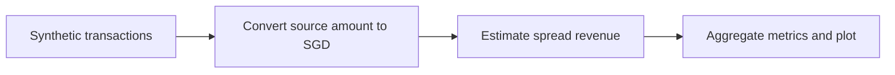

# Cross-Border Payments Analytics

A small Python simulation for exploring payment volume and estimated FX spread revenue across currency corridors. It generates **fictional transactions**; it does not process payments or fetch live exchange rates.

## What it does

1. Generate 1,000 synthetic transactions with a source currency (SGD, USD or EUR), destination currency (THB, MYR or IDR), source amount, spread percentage and timestamp.
2. Convert each **source amount into SGD** using fixed illustrative rates, then estimate spread revenue in SGD.
3. Apply a simple rules-based flag to transactions above SGD 1,500 and a score that also counts spreads above 1.2%. This is not a trained fraud model.
4. Calculate total payment volume, average transaction size and estimated spread revenue in SGD. Group revenue by source–destination currency pair and plot corridor and daily totals.



## Reporting currency and assumptions

`amount` is denominated in `from_currency`. To compare transactions, the script applies these **toy assumptions** (SGD per one unit of source currency):

| Source currency | SGD per unit |
|---|---:|
| SGD | 1.00 |
| USD | 1.35 |
| EUR | 1.47 |

These are illustrative constants, **not live or historical exchange quotes**. For example, a fictional USD 100 payment at a 1% spread becomes `amount_sgd = 100 × 1.35 = SGD 135` and `revenue_sgd = 135 × 1% = SGD 1.35`. The resulting total payment volume is the sum of `amount_sgd`, never a sum of unlike currencies. A transaction with an unknown source currency raises an error rather than silently producing a misleading total.

The destination currency is a label used for corridor grouping. The script does **not** calculate the recipient amount, a conversion into the destination currency, provider fees, processing costs, profit or real fraud risk. “Revenue” here means only a simplified **estimated FX spread component**, not actual company revenue.

## Project files

| File | Role |
|---|---|
| `src/simulation.py` | Generates transactions and SGD reporting values |
| `src/risk_model.py` | Applies transparent heuristic flags and scores |
| `src/metrics.py` | Aggregates SGD metrics and corridor revenue |
| `main.py` | Runs the analysis and displays two charts |
| `tests/test_reporting.py` | Checks conversion, aggregation and unknown-currency handling |

## Run

With Python installed:

```bash
python -m pip install -r requirements.txt
python main.py
python -m unittest discover -s tests
```

The random generator uses a fixed seed, so runs produce the same sample. Close the chart window to end the script. The synthetic timestamps begin on 1 January 2024; they are sample dates, not observed transactions.

## What I would improve next

- Model a destination amount with a clearly defined mid-market rate and customer quote.
- Separate spread, fixed/variable fees and processing costs to estimate contribution margin.
- Compare corridors fairly using transaction counts and revenue per transaction, not just total revenue.
- Replace toy rates with dated, documented rate inputs and handle currency precision appropriately.
